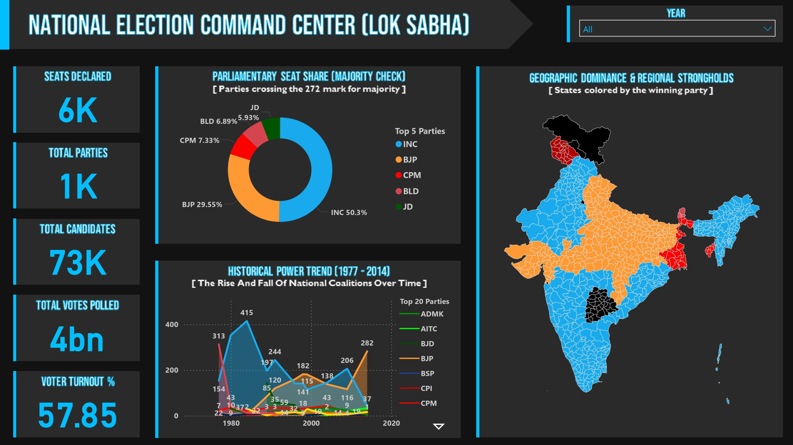
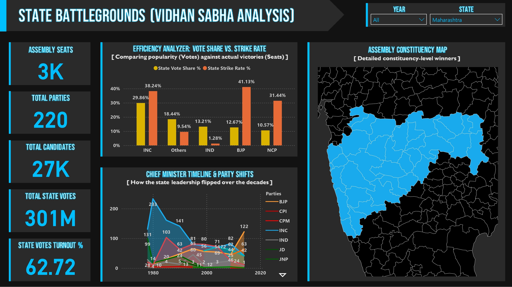
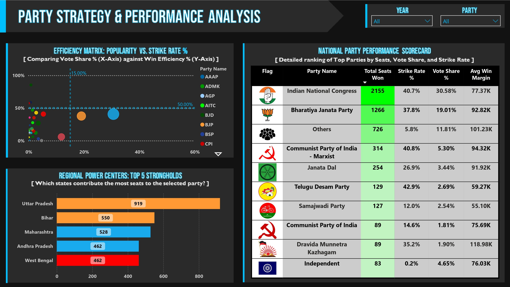
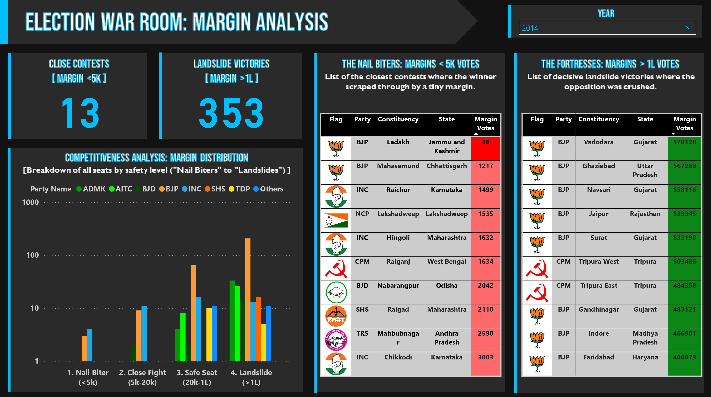

 📊 ElectiViz: Election Intelligence Dashboard

 🧠 Project Overview
ElectiViz is a broadcast-quality election analytics platform built for newsrooms, political analysts, and data journalists. 
It standardizes and analyzes 400,000+ election records across nearly four decades (1977–2014) of Indian political history to reveal high-impact performance metrics such as Strike Rate, Winning Margin, and Voter Turnout Dynamics.

The platform supports **live election coverage, post-election deep dives, and data-driven political storytelling.

 🖼️ Dashboard Gallery

 1️⃣ National Command Center

 2️⃣ State Battlegrounds

 3️⃣ Party Strategy & Performance Analysis

 4️⃣ Demographic Analysis: Gender & Turnout

 5️⃣ Election War Room: Margin Analysis

 🛠️ Technical Highlights

 🔧 Tech Stack
- Python (Pandas, NumPy) – ETL and data transformation  
- Microsoft Power BI – Interactive dashboards and advanced DAX  
- Microsoft Excel – Metadata and asset management  

 🧩 Data Architecture
- Galaxy Schema (Multi-Fact Architecture)
- Cross-filtering enabled between:
  - Lok Sabha Elections  
  - Vidhan Sabha Elections  
- Supports party, state, and demographic slicing

 📐 Advanced Analytics
28+ optimized DAX measures, including:
  - Strike Rate
  - Winning Margin %
  - Dynamic Winning Party Colors
  - Gender-wise Voter Turnout
 - Performance-tuned for large datasets

✅ Data Validation
- Aggregate reconciliation checks  
- Cross-filtering stress tests  
- Ensures 100% data accuracy**

 🎯 Use Cases
- 📺 Media election coverage  
- 🗳️ Political performance analysis  
- 📊 Academic research  
- 📰 Data journalism  

